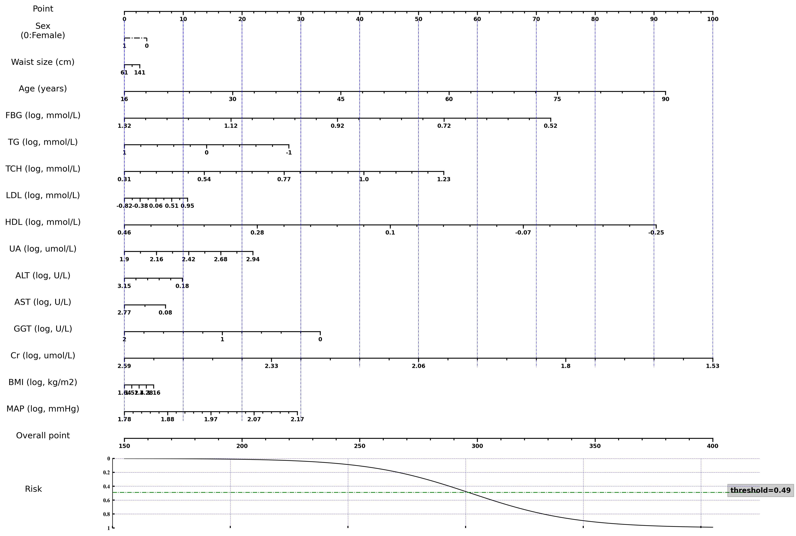

# Thyroid Nodule Risk Prediction

This README provides a tutorial for using a Jupyter Notebook to predict the risk of developing thyroid nodules based on user input. The notebook utilizes pre-trained machine learning models to assess the 3-year risk of nodule onset.

## Prerequisites

Before you begin, ensure you have the following installed:
- Python 3.8 or above
- Jupyter Notebook
- Required Python libraries: `pandas`, `numpy`, `scikit-learn`, `matplotlib`

You can install the required libraries using the following command:

```bash
pip install pandas numpy scikit-learn matplotlib
```

## Getting Started

1. Clone the repository or download the Jupyter Notebook and the pre-trained model from the provided link.

2. Launch Jupyter Notebook by running the following command in your terminal:

```bash
jupyter notebook
```

3. Navigate to the directory containing the downloaded notebook and open it.

## Notebook Structure

The notebook is structured as follows:

1. **Introduction**: An overview of the thyroid nodule risk prediction and instructions on how to use the notebook.

2. **Data Input**: A section for inputting user data. You will be prompted to enter relevant clinical features such as age, HDL-C levels, FBG levels, and creatinine levels.

3. **Model Loading**: Code to load the pre-trained machine learning model.

4. **Risk Prediction**: The notebook will use the input data to predict the risk of developing thyroid nodules and display the result.

5. **Interpretation**: Explanation of the risk score and guidance on potential next steps based on the score.

## Using the Notebook

Follow the instructions within the notebook to input the required data. Each cell can be executed by selecting it and pressing `Shift + Enter`. Ensure that you run the cells in the order they appear.

## Alternative Tools

A calibrated [nomogram](Nomogram.png) based on the regression model is provided to simplify the risk assessment in clinical settings.



An Excel spreadsheet (Thyroid nodule risk prediction.xlsx) is also available to facilitate the use of this approach on electronic devices. Users just need to enter values for required clinical indicators, and the risk can be automatically calculated. 

## Support

For any issues or questions regarding the notebook, please refer to the 'Support' section at the end of the notebook or contact the repository maintainer.

## Data Privacy

Please note that any input data you provide should be handled in accordance with relevant data privacy regulations. Do not share personal health information in public repositories or forums.

## License

This tutorial and the accompanying Jupyter Notebook are provided under the [Apache 2.0 license](LICENSE.txt).

## Acknowledgments

We would like to thank the contributors and maintainers of the Python libraries used in this project.

